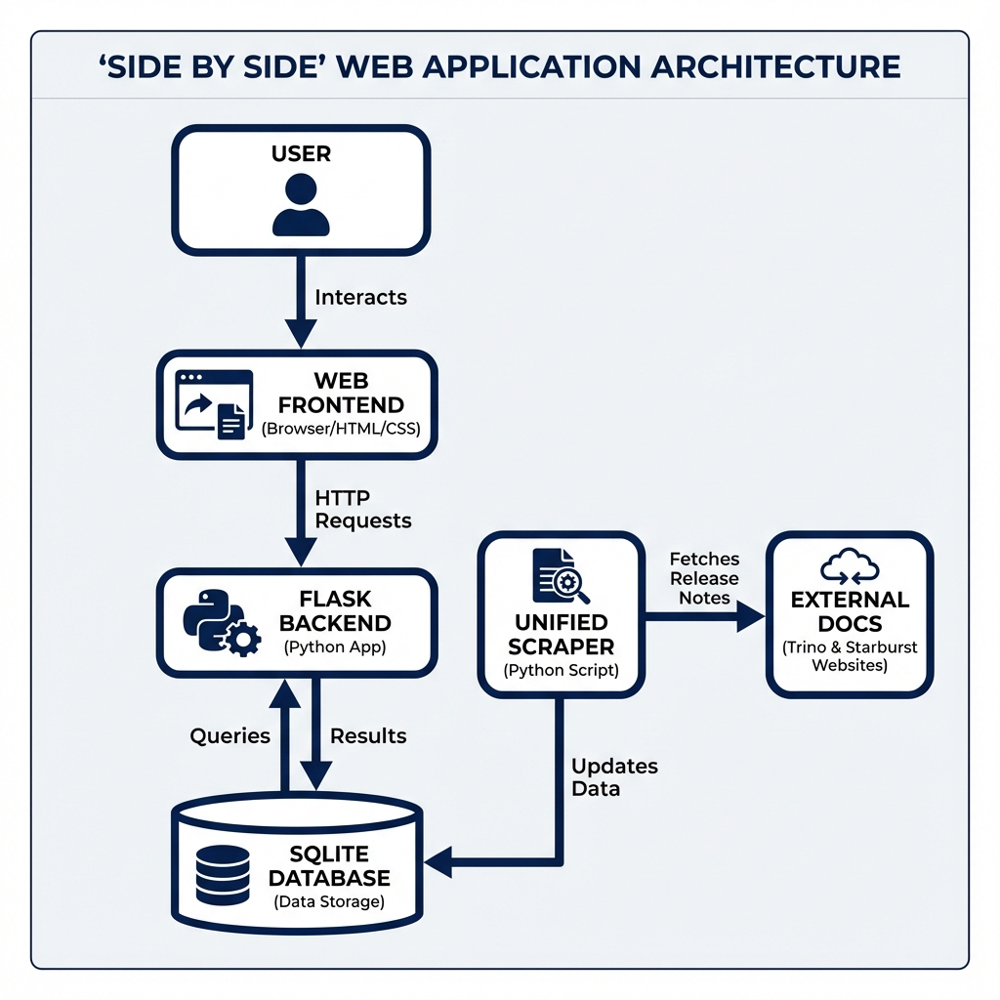

# Trino Version Comparison

A Flask-based web application for comparing versions of Trino and Starburst. It allows users to view changes between versions, filter by connectors, and identify breaking changes.



## Features

-   **Version Comparison**: Compare any two versions of Trino or Starburst.
-   **Connector Filtering**: Filter changes by specific connectors (e.g., Hive, Delta Lake).
-   **Breaking Changes**: Dedicated section for breaking changes.
-   **Search**: Search for specific changes by keyword.
-   **PDF Export**: Export comparison results to PDF.
-   **Analytics**: Track popular searches and comparisons (requires authentication).

## Tech Stack

-   **Backend**: Python 3.11+, Flask, SQLAlchemy
-   **Database**: SQLite (default), PostgreSQL compatible
-   **Frontend**: HTML, Bootstrap 5, FontAwesome
-   **Server**: Apache2 with mod_wsgi

## Installation

1.  **Clone the repository**:
    ```bash
    git clone https://github.com/kringz/xsidebyside.com.git
    cd xsidebyside.com
    ```

2.  **Create a virtual environment**:
    ```bash
    python3 -m venv venv
    source venv/bin/activate
    ```

3.  **Install dependencies**:
    ```bash
    pip install -r requirements.txt
    # OR if using pyproject.toml
    pip install .
    ```

4.  **Configure Environment**:
    Create a `.env` file in `xsidebyside.com/public_html/`:
    ```ini
    ANALYTICS_ENABLED=true
    ANALYTICS_USERNAME=admin
    ANALYTICS_PASSWORD=your_secure_password
    SECRET_KEY=your_flask_secret_key
    DATABASE_URL=sqlite:///trino_versions.db
    ```

5.  **Initialize Database**:
    ```bash
    python xsidebyside.com/public_html/main.py
    ```

## Deployment

The project includes a `deploy.sh` script for Ubuntu/Apache deployment.

```bash
sudo ./xsidebyside.com/public_html/deploy.sh
```

**Security Note**: Ensure you update `trino_sidebyside.conf` with your domain and enable SSL/TLS using Certbot.

## Security

-   **CSRF Protection**: Enabled via Flask-WTF.
-   **Security Headers**: HSTS, CSP, and others are configured in Apache.
-   **Authentication**: Basic Auth required for `/analytics`.

## License

[MIT License](LICENSE)
